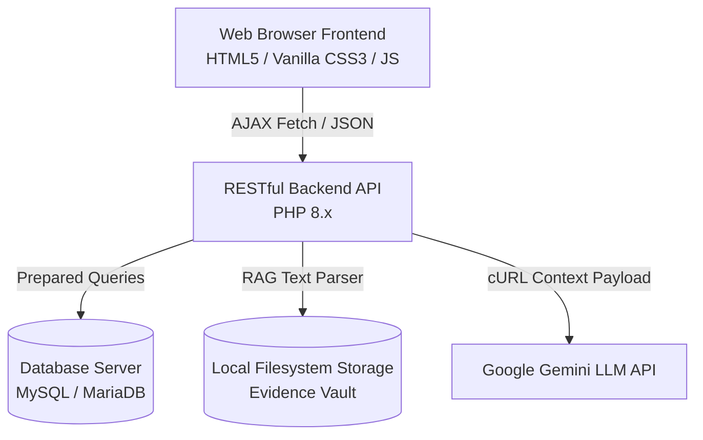
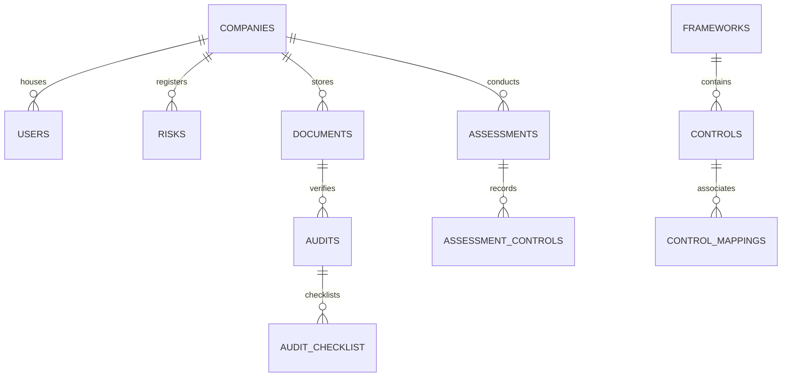

# Compliance Audit Automation Platform — Comprehensive Documentation

This document serves as the master technical specification, installation guide, and operations manual for the Compliance Audit Automation Platform.

---

## 🏛️ 1. Architecture

The platform follows a **decoupled Client-Server Architecture** utilizing clean, native technologies to maintain lightweight performance, scalability, and security:



### Key Architectural Layers:
1. **Presentation Layer (Frontend)**:
   * **Structure**: Semantic HTML5 documents located in the root and `/pages/` directory.
   * **Style**: A centralized theme design system implemented in `css/style.css` (custom dark theme).
   * **Behavior**: Interactive client logic, API calls, event captures, and CSRF token injections in `js/app.js`.
2. **Application Layer (API Backend)**:
   * RESTful routing utilizing single-purpose endpoints inside `backend/api/`.
   * Centralized configuration loaders for database connections, session variables, and cryptographic configurations in `backend/config/`.
3. **Storage Layer (Database & Filesystem)**:
   * Relational data storage inside MySQL (`localhost` database name: `aks`).
   * Document vault storage inside `backend/uploads/` directory on the local filesystem.

---

## 📂 2. Folder Structure

```
AKS/
├── css/
│   └── style.css            # Global CSS custom properties, variables, components, and animations
├── js/
│   └── app.js               # Global Javascript (fetch wraps, CSRF, toast, session, active nav)
├── pages/                   # Frontend workspace screens
│   ├── ai-assistant.html    # Chat interface for the AI Compliance Assistant & Suggestions
│   ├── assessment.html      # Mapping wizard, auto-mapping trigger, and compliance indicators
│   ├── audit-checklist.html # Core audit tracker showing checklist progress bars
│   ├── change-password.html # Redirect form enforced on first-login users
│   ├── companies.html       # Company directory (grid/list mode, paginator, search filters)
│   ├── control-mapping.html # Framework mapping configuration view
│   ├── gap-analysis.html    # Compliance gap indicators and matrices
│   ├── reports.html         # Report downloader screen linking PDF generators
│   ├── upload-documents.html# Evidence uploads list, size metadata, modal previews
│   └── users.html           # User & Auditor directory list and password reset
├── backend/
│   ├── api/                 # Single-purpose RESTful backend API scripts
│   │   ├── ai_chat.php      # Compiles stats context, calls Gemini/fallback, runs RAG search
│   │   ├── audit_readiness_report.php # PDF generator for audit readiness details
│   │   ├── generate_report.php        # Core PDF assessment generator (charts, summaries, advices)
│   │   └── ...              # CSRF, Login, Logout, Otp, Company CRUD, Risk CRUD, User CRUD
│   ├── config/              # Centralized backend configuration loaders
│   │   ├── database.php     # MySQLi DB connection and automatic database tables/alterations check
│   │   ├── auth.php         # Central session flags, lockouts check, CSRF checks, and RAG parsers
│   │   ├── response.php     # Unified JSON return functions (send_success / send_error)
│   │   └── ai_config.php    # API key environment parser
│   ├── fpdf/                # Bundle third-party library for PDF generation
│   └── uploads/             # Physical storage directory for uploaded evidence files
├── login.html               # Main login screen (credentials + OTP MFA card states)
├── dashboard.html           # Primary admin/user dashboard console
├── schema.sql               # Baseline database structure script
└── DOCUMENTATION.md         # Master project documentation file (this document)
```

---

## 🗄️ 3. Database Schema

The platform database consists of **13 relational tables** mapping multi-tenant compliance metrics:



### Table Definitions & Specifications:

1. **`companies`**
   * Stores information for audited organization entities.
   * *Fields*: `company_id` (PK), `company_name`, `registration_number`, `industry`, `address`, `contact_email`, `contact_phone`, `status`, `created_at`.
2. **`users`**
   * Stores credentials and session properties for platform users.
   * *Fields*: `user_id` (PK), `company_id` (FK to `companies`), `full_name`, `email`, `password` (hashed), `role` (`admin`/`user`/`auditor`), `first_login` (boolean), `created_at`.
3. **`frameworks`**
   * Regulatory compliance standards (e.g. BNM RMiT, PayNet TPA, MAS TRM).
   * *Fields*: `framework_id` (PK), `framework_name`, `description`, `created_at`.
4. **`controls`**
   * Specific checklist requirements belonging to a framework.
   * *Fields*: `control_id` (PK), `control_code`, `control_name`, `framework_id` (FK to `frameworks`).
5. **`control_mappings`**
   * Maps controls between different frameworks to compute overlaps.
   * *Fields*: `mapping_id` (PK), `control_id` (FK to `controls`), `master_control_id` (FK to `controls`).
6. **`assessments`**
   * Track compliance status for a company against target frameworks.
   * *Fields*: `assessment_id` (PK), `company_id` (FK to `companies`), `current_framework_id`, `target_framework_id`, `compliance_percentage`, `created_at`.
7. **`assessment_controls`**
   * Individual status evaluation for each mapped control.
   * *Fields*: `assessment_control_id` (PK), `assessment_id` (FK to `assessments`), `control_id` (FK to `controls`), `status` (`Matched`/`Missing`).
8. **`audits`**
   * Tracks verification audits initiated from evidence uploads.
   * *Fields*: `audit_id` (PK), `company_id` (FK to `companies`), `document_id` (FK to `documents`), `progress` (0-100), `status` (`In Progress`/`Completed`), `created_at`.
9. **`audit_checklist`**
   * Checklist items tracked for individual audits.
   * *Fields*: `checklist_id` (PK), `audit_id` (FK to `audits`), `checklist_item`, `is_completed` (boolean), `updated_at`.
10. **`documents`**
    * Uploaded evidence files mapping to specific frameworks/controls.
    * *Fields*: `document_id` (PK), `company_id` (FK to `companies`), `file_name`, `file_path`, `framework`, `control_code`, `status`, `extracted_text` (LONGTEXT), `created_at`.
11. **`login_attempts`**
    * Tracks failed credential queries to enforce locks.
    * *Fields*: `attempt_id` (PK), `email` (INDEXED), `ip_address`, `attempt_time`.
12. **`activity_logs`**
    * Auditable operations trail.
    * *Fields*: `log_id` (PK), `actor_type` (`admin`/`user`), `actor_id`, `action`, `ip_address`, `logged_at`.
13. **`risks`**
    * Risk register log.
    * *Fields*: `risk_id` (PK), `company_id` (FK to `companies`), `risk_title`, `risk_description`, `likelihood` (1-5), `impact` (1-5), `risk_score` (`likelihood * impact`), `mitigation_strategy`, `status`, `created_at`.

---

## ⚙️ 4. Security Hardening

The platform implements strict defensive security controls protecting against core OWASP Top 10 vulnerabilities:

1. **SQL Injection (SQLi) Protection**:
   * All database operations utilize **MySQLi prepared statements**. No variables are concatenated directly into SQL query strings.
2. **Cross-Site Scripting (XSS) Protection**:
   * **Input Sanitization**: Backend endpoints sanitize all inputs using a global HTML tag rejection checker (`has_html_tags()`). Attempts to insert scripting elements trigger a `400 Bad Request` block.
   * **Output Escaping**: The frontend renders user-controlled variables using a global `escapeHtml()` utility, ensuring no raw HTML strings execute in DOM elements.
3. **Cross-Site Request Forgery (CSRF) Protection**:
   * State-modifying APIs verify a cryptographically secure session CSRF token.
   * The frontend client (`js/app.js`) intercepts all fetch requests, automatically injecting the token via the `X-CSRF-Token` header.
4. **Session & Cookie Security**:
   * Session cookies are hardened using parameters: `Secure` (HTTPS only), `HttpOnly` (inaccessible to JS scripts), and `SameSite=Lax` (prevents CSRF cross-origin leakage).
   * Sessions automatically regenerate IDs (`session_regenerate_id(true)`) upon user authentication.
   * Sessions expire after **15 minutes of inactivity**.
5. **Brute-Force & Lockout Policy**:
   * Accounts are temporarily locked for **15 minutes** after **5 failed login attempts** inside a rolling window. Lockout checks are accelerated via SQL indexes.
6. **Multi-Factor Authentication (Email OTP)**:
   * Logging in requires entering a **6-digit verification code** sent to the user's email (simulated inside `otp_output.txt`).
   * The OTP expires in **5 minutes** and is limited to **3 verification attempts**.

---

## 🤖 5. AI Compliance Assistant & RAG

The platform features an intelligent, context-aware AI Compliance Assistant with an integrated RAG (Retrieval-Augmented Generation) pipeline:

### RAG Pipeline:
1. **File Upload & Parsing**:
   * When an evidence file (`.txt`, `.pdf`, `.docx`, `.xlsx`) is uploaded, it is parsed by pure PHP parsers:
     * *PDF*: Decodes text streams inside PDF document segments (`Tj`/`TJ` syntax).
     * *DOCX/XLSX*: Extracts XML content using `ZipArchive` and strips tags.
     * *TXT*: Direct string extraction.
   * Plain text is stored in the `extracted_text` column.
2. **Dynamic Backfilling**:
   * The backend dynamically indexes any previously uploaded files containing un-extracted text whenever a user queries the AI Assistant.
3. **Relevance Query Retrieval**:
   * Queries are matched against document text using a keyword occurrence scorer. Standard users are restricted to searching only their own company's uploaded documents.
4. **Context Injection**:
   * Retrieved document snippets are formatted and prepended directly to the LLM system prompt context, ensuring it responds with accurate, domain-specific evidence details.
   * If running in fallback mode, matching document snippets are appended directly to the advisory response.

---

## 📥 6. Installation Guide

### Prerequisites:
* Apache Web Server (with `mod_rewrite` enabled).
* PHP 8.0 or higher (with `mysqli`, `zip`, `curl` extensions enabled).
* MySQL 5.7+ or MariaDB 10.3+.

### Step-by-Step Setup:
1. **Clone the Repository**:
   Place the project folder into your web server root directory (e.g. `/var/www/html/` or `C:/xampp/htdocs/`).
2. **Initialize the Database**:
   * Log in to phpMyAdmin (or your local MySQL CLI).
   * Create a new database named `aks`.
   * Import the `backend/schema.sql` file.
3. **Configure Environment Parameters**:
   * Create a file named `.env` in the `backend/` directory.
   * Insert your credentials and Gemini API Key:
     ```env
     AI_PROVIDER="gemini"
     AI_API_KEY="YOUR_ACTUAL_GEMINI_PRO_API_KEY"
     ```
4. **Initialize Directory Permissions**:
   * Ensure the server has write permissions on `backend/uploads/` and `backend/api/../otp_output.txt`.
5. **Verify Access**:
   Open **`http://localhost/AKS/login.html`** in your browser. The platform database tables will auto-initialize/alter automatically.

---

## 👤 7. User Manual

### 1. Multi-Factor Authentication:
* Enter your registered email and password on the Login page.
* You will be redirected to the Verification Card. Retrieve the 6-digit verification code from `otp_output.txt` (or copy it from the developer toast notification at the bottom right) and submit it to access the console.

### 2. Modernized Dashboard:
* View your overall progress gauge, active alerts, registered risk metrics, and quick action cards. Hover over elements to trigger smooth hover effects.

### 3. Uploading Evidence:
* Go to the **Documents** screen.
* Upload policy documents (PDF, Word, Excel, TXT). Ensure files do not exceed **10MB**.
* Use the **Preview** button (eye icon) to view images in a popup, or open documents in a new tab.
* Enter search terms in the filter bar to dynamically isolate relevant compliance files.

### 4. Chatting with the AI Assistant:
* Go to the **AI Assistant** screen.
* Submit standard prompts (e.g. click the *Executive Summary* card to analyze your database statistics) or type custom security queries.
* Conversations are automatically saved in history logs and can be cleared using the *Clear History* option.

---

## 👑 8. Admin Manual

### 1. Company Management:
* Access the **Companies** workspace.
* Register new company profiles. Inputs with HTML tags are automatically blocked.
* Use grid or list display view toggles, type multi-field searches (name, registration number, industry), and navigate through pages using pagination controls.

### 2. User & Auditor Management:
* Access the **Users** workspace.
* Register new employees or external auditors.
* Click the **Reset Password** button next to any user. The system will generate a secure temporary password and force a change-password page redirect upon their next login.

### 3. Reviewing Auditable Logs:
* All critical operations (logins, lockouts, company additions/edits, evidence uploads, logouts) are written to the database `activity_logs` table for auditor review.

---

## 🚀 9. Future Enhancements

1. **Advanced Vector Embedding Integration**:
   Transition the keyword RAG engine to a database-backed vector store (e.g. SQLite vector extension or pgvector) when scale requirements justify additional infrastructure.
2. **Automated OCR Scanning**:
   Integrate an OCR engine (such as Tesseract PHP) to extract text contents from uploaded JPG/PNG image evidence files (e.g. server configuration screenshots).
3. **Webhook Mappings Notifications**:
   Create real-time webhook endpoints that trigger notifications to external auditor portals when compliance thresholds change.
